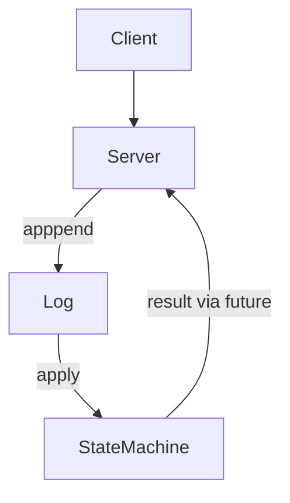
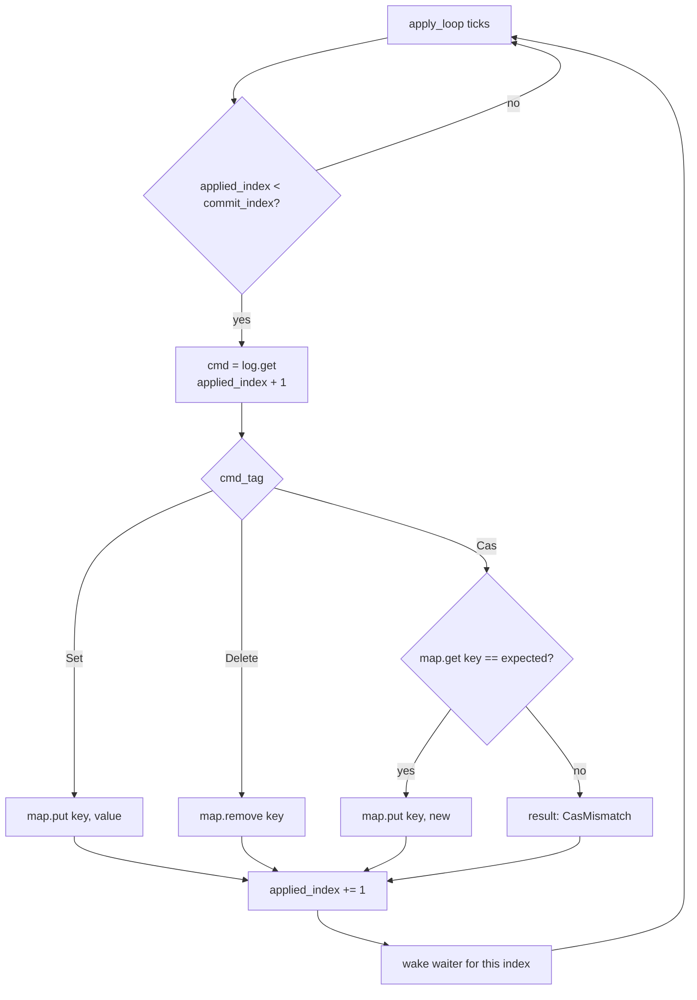

# zig raft

Hopefully, one day a full [raft] implementation in [zig].

Why? Because.

> [!NOTE]
> This is just a research project for me to learn [zig] and have fun implementing [raft]

[zig]: https://ziglang.org/
[raft]: https://raft.github.io/

## Design

### Log Structure

See [wal-format](./docs/wal-format.md)

### State Machine

