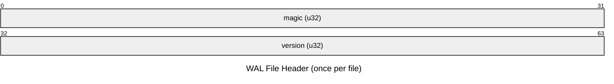
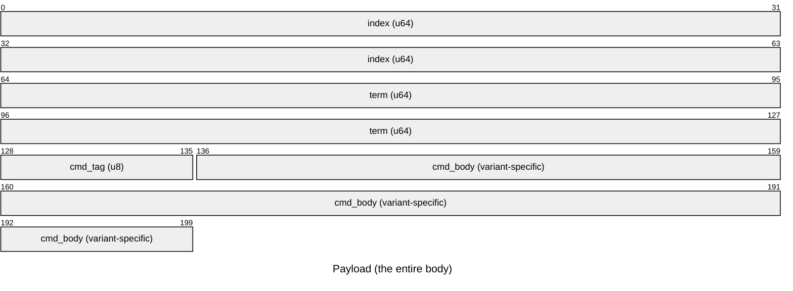
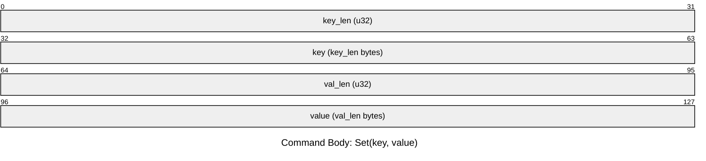

# WAL Binary Format

The following mermaid packet diagrams explain the binary format to serialize log entries in the WAL to be used in the Raft log.

```mermaid
---
title: "WAL File Header (once per file)"
---
packet-beta
0-31: "magic (u32)"
32-63: "version (u32)"
```

```mermaid
---
title: "WAL Entry (repeats for each entry)"
---
packet-beta
0-31: "length (u32)"
32-63: "crc32 (u32)"
64-95: "payload (length bytes)
```

```mermaid
---
title: "Payload (the entire body)"
---
packet-beta
0-63: "index (u64)"
64-127: "term (u64)"
128-135: "cmd_tag (u8)"
136-199: "cmd_body (variant-specific)"
```

```mermaid
---
title: "Command Body: Set(key, value)"
---
packet-beta
0-31: "key_len (u32)"
32-63: "key (key_len bytes)"
64-95: "val_len (u32)"
96-127: "value (val_len bytes)"
```
